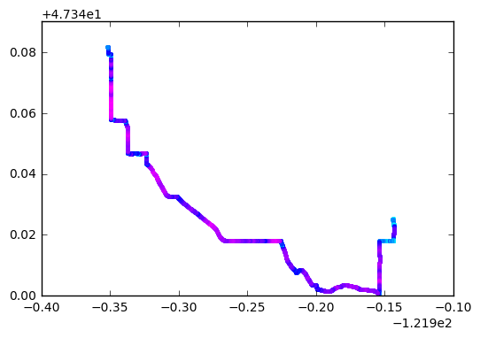

# GPS DATA CLIENT and SERVER

GPS Data client and Server implemented in node.js with Raspberry Pi GPS Data Logger Use Case

# Installation

## Dependencies

* [node.js](https://nodejs.org/en/download/)
* [npm](https://www.npmjs.com/)
* [sqlite](https://sqlite.org/)

The node.js package manager, `npm`, is recommended to install module dependencies. The server database is managed with `sqlite3`

For installation, refer to the instructions for your OS on the installation page of each of the dependencies.

## Install

    $ git clone https://github.com/p5a0u9l/gps_db # clones the repository
    $ cd gps_db
    $ npm install # installs the local module dependencies

## Configuration

`gps_db` comes with a `config.json` file with modifiable entries for

* `SERVER_IP`
* `PORT_NUMBER`
* `CLIENT_KEY_FILENAME`
* `DATABASE_NAME`

# Usage Overview

## Server

Entering

    $ node server.js

creates a new `sqlite3` database using the path found in `config.json` and binds the server application to the configured port.

## Client

### Register a new client

Before pushing any gps records, enter

    $ node gps_client.js register

This creates a new client entry in the server's database and returns the key to the client application, which in turn, writes it to the file path found in `config.json`.

Different clients can be registered with the server, however, currently, only one client key file is read when running the client application. To manage two separate clients, clone the repo to two seperate directories, or two seperate machines.

### Pushing new gps records

Assuming you have a local file called `my_gps_file.json`, issuing

    $ node gps_client.js consume ./my_gps_file.json

will stream the file contents to the server and store them in a `gps_records` table indexed by your unique client id.

### GPS record format

The server expects messages formatted by `gpsd`, a common Linux/FreeBSD daemon that receives data from GPS receivers. The messages should follow the JSON format below

    {
        "class":"TPV",
        "mode":3,
        "time":"2016-12-07T01:58:33.000Z",
        "lat":47.421816667,
        "lon":-122.251965000,
        "alt":11.900,
        "speed":0.005,
    }

A sample history of records is found under [record_stream.json](sample_data/record_stream.json)

The server/client registration can be tested using

    $ node gps_client.js consume ./sample_data/record_stream.json

### Fetching gps history

Issuing the command

    $ node gps_client.js fetch

will fetch the entire history indexed by your key and write them to the local JSON file called out in `config.json`.

# Typical Client Use Case

The following walks through a typical `gps_db` use case, assuming the necessary dependencies are already installed.

The server application for this example is running an EC2 instance on AWS. The `config.json` file currently points to the server.

## Set up

    $ git clone https://github.com/p5a0u9l/gps_db # clones the repository
    $ cd gps_db

## First client

    $ node gps_client.js register # registers your key with server
    $ node gps_client.js consume sample_data/record_stream01.json # push a sample set of GPS records
    $ node gps_client.js consume sample_data/record_stream02.json # push a sample set of GPS records
    $ node gps_client.js fetch # retrieve the entire history

## Second client

    $ node gps_client.js register # registers your key with server
    $ node gps_client.js consume sample_data/record_stream01.json # push a sample set of GPS records
    $ node gps_client.js fetch # retrieve the entire history

# GPS Data-Logging Use Case

### _abstract_
This mini-project implements a simple GPS data-logging system to record position, time, and velocity during my morning and evening commutes from Maple Valley, WA, to Kent, WA, and back.

## Hardward Configuration
The data-logging system is implemented on a [Raspberry Pi 3](https://www.raspberrypi.org/products/raspberry-pi-3-model-b/)(RPi) single-board computer, connected via a [USB-TTL adapter](https://www.amazon.com/JBtek%C2%AE-WINDOWS-Supported-Raspberry-Programming/dp/B00QT7LQ88/ref=pd_bxgy_23_img_3?_encoding=UTF8&pd_rd_i=B00QT7LQ88&pd_rd_r=DVMW2MNRZ9JY7Y6295FG&pd_rd_w=j2fIe&pd_rd_wg=3QblB&psc=1&refRID=DVMW2MNRZ9JY7Y6295FG<Paste>) to an [Adafruit Ultimate GPS Breakout](https://www.adafruit.com/product/746) module. The module is built around an [MTK3339 GPS chipset](https://cdn-shop.adafruit.com/datasheets/GlobalTop-FGPMMOPA6H-Datasheet-V0A.pdf) which features a high-sensitivity receiver and an onboard patch antenna. Finally, [gpsd](http://www.catb.org/gpsd/) serves as a monitor and parser of incoming messages and makes them available on a local TCP/IP port for client applications.

## GPS Logger
The system is powered-up at the beginning of a trip by connecting to a battery and powered down at the end of the commute by disconnecting the power source. The [10000 mAh battery](https://www.amazon.com/gp/product/B0194WDVHI/ref=oh_aui_search_detailpage?ie=UTF8&psc=1) is intended for mobile recharge of smart phones and will repeatedly power the combined RPi/GPS receiver for several weeks at 1 hour per day usage. The logging software is wrapped in a `systemd` service that enables it to go into action on bootup and run continuously until losing power.

## Data Download
At the end of each day, the system is connected to a home network via a USB Wi-Fi adapter. A second, very simple `systemd` service is enabled, which listens for a network connection event. On connection, it synchronizes any on-board GPS logs with a remote server running on [AWS](https://aws.amazon.com/).

# Project Review

This section contains a review of the homework assignment for UW EE590 - Advanced Embedded Systems - that initiated this project.

## Client/Server Caveat

### Problems

1. The `node` API to `sqlite3` seems slower than I anticipated. It may be the implementation, although I tried a few different strategies.

2. The asynchronous nature of `node` causes the server to respond before the disk write is complete.

### Fixes

1. After pushing the file under `sample_data` or files of similar size, give the server about 30 sec. to a minute to completely write the records to disk.

2. For the second issue, issuing `fetch` a second time will flush the server responses and write the gps records to the file.

## Extensions

This project could be extended first by correctly handling events on the server side such that responses are delayed until are records are written to disk.

Another extension would be developing the visualization of gps data.
